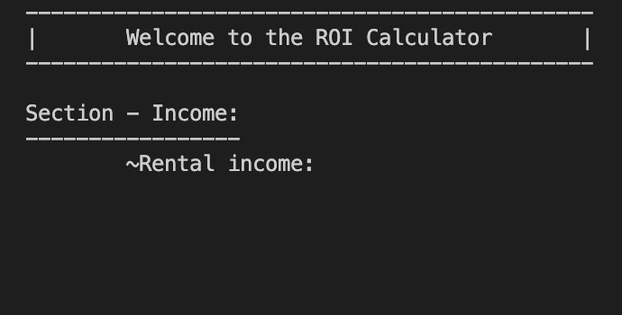

# 
ROI Calculator :robot:

##### 
This was an over the weekend project to create a program that will calculate the ROI on a potential investment property. This was coded in Python using Object Oriented Programming.

